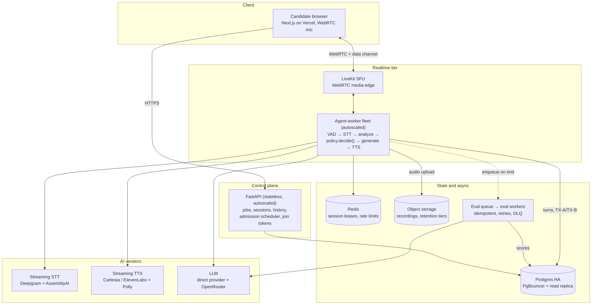
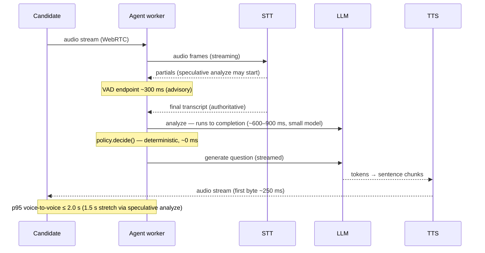

# Scaling Proposal — AI Interviewer Platform

Design exercise: scale the platform to **2M users**, **30,000 interviews/day**, and
**100 concurrent voice calls**, keeping the same product scope (voice-to-voice
interview agent with STT, TTS, and an LLM). Authentication is out of scope.

This document proposes a target architecture, the reasoning behind each decision,
the alternatives rejected, a rollout plan, and the open questions that would shape
the final design. Where a decision reverses a stage-1 decision or ADR, the reversal
is named explicitly.

**Market assumption, stated up front:** the brief is geography- and
language-agnostic, and the shipped app targets English (`lang = "en-US"` in the
speech-recognition hook). This design therefore assumes a US/English default
market. Vendor choices deliberately keep multilingual expansion open, but launch
geographies and languages are treated as an open question (§10), not a
requirement.

---

## 1. Capacity model

Start from the numbers — they decide what actually needs scaling. Peak factors
below assume a ~4× diurnal peak over average; this is an assumption to validate
against real traffic shape, not a measurement.

| Dimension | Derivation | Result |
| --- | --- | --- |
| Answer submissions | 30k interviews × ~8 Q/A cycles | ~240k/day ≈ 3/s avg, ~12/s peak |
| LLM calls | ~2 per cycle (analyze + generate) + 1 eval per interview | ~510k/day ≈ 6/s avg, ~25/s peak |
| DB writes | ~16 turn rows (candidate + interviewer both persist) + session/evaluation rows per interview | ~700k rows/day ≈ 8/s avg, ~32/s peak |
| Voice minutes | 30k × ~10 min | ~300k min/day ≈ **9M listening min/month** (TTS synthesis is ~2–3 min/interview ≈ 1.8–2.7M min/month) |

Conclusions:

1. **Compute is not the problem.** Tens of requests and writes per second are
   small. The scaling problems are the realtime voice pipeline, turn-boundary
   semantics, vendor quotas, and unit economics.
2. **The stated numbers force admission control.** 100 concurrent calls × 1,440
   min/day ÷ 30,000 interviews = 4.8 min/interview. At a 10-minute average, a
   hard 100-concurrent cap supports ~14.4k interviews/day, and 30k/day implies
   ~208 average concurrent. We treat **100 concurrent as the admission cap**
   (the exercise constraint): the scheduler dispatches at most 100 live calls,
   and 30k/day is reachable only because interviews are scheduled events spread
   across the day, or because interviews average ~5 minutes. The fleet is sized
   to the cap plus headroom; raising the cap to ~210+ is a capacity-config and
   cost decision, not an architecture change — but it is a business decision to
   escalate, not something the design silently does.
3. **Each requirement shapes a different tier.** 2M users → storage, history
   reads (cursor pagination), CDN, abuse quotas. 30k/day → vendor rate limits
   and cost. 100 concurrent → realtime media tier and admission policy.

## 2. Baseline (current architecture)

| Concern | Today | Production gap |
| --- | --- | --- |
| STT | Browser Web Speech API (client-side) | Unreliable outside Chrome (fails in Brave/Firefox); recognition may run on the browser vendor's servers (frontend ADR-006) — the platform never has custody of audio |
| TTS | Browser `speechSynthesis` | Voice quality varies per device; no control |
| LLM | OpenRouter, single model via env | No model tiering; no cross-vendor failover (gateway retry is same-vendor, 2 attempts); no streaming support in the gateway |
| Runtime | Sync end-to-end: sync handlers, sync SQLAlchemy, sync `httpx` (ADR-002) | Realtime agent SDKs are asyncio; migration is explicitly "a deliberate, broader migration plan" per ADR-002 |
| Backend | FastAPI, single Railway instance | No horizontal scale, sleeps on idle |
| Database | Railway Postgres | No pooling, no replica, no HA guarantees; history pagination is a fixed cap (cursor pagination deferred) |
| Audio custody | None | Transcript and decision-panel replay **exist** today; what's missing is audio recording, audio replay, and the ability to re-transcribe past interviews |

What carries over — precisely scoped: the deterministic policy
(`engine/policy.py::decide()`, a pure function), the analyze → decide → generate
split (D1), TX-A/TX-B transaction choreography (ADR-003, no transaction held
across LLM calls), idempotency via a unique `(session_id, client_turn_id)` index,
and dangling-candidate-turn recovery. These are **turn-boundary invariants**: they
apply once a candidate turn is persisted. The media-to-turn adapter in front of
them is new, and is designed in D-S3/D-S4 below.

## 3. Key decisions

### D-S1. Move speech server-side

Browser-native speech fails at production scale for a hiring product: no browser
coverage guarantee (Brave/Firefox broken today), inconsistent quality, and —
decisive — no audio custody. Without server-side audio there are no recordings,
no audio replay, no re-transcription with better models, and no audio evidence
trail for bias review. Stage 1 already has transcript + decision-panel replay;
this decision adds the audio layer those can't provide.

### D-S2. WebRTC transport via a managed SFU

**Alternative considered — WebSocket audio streaming** (Twilio-media-streams
style): viable at 100 concurrent calls and simpler to reason about. Rejected
because: (a) WS rides TCP — head-of-line blocking on unmanaged candidate
networks (mobile, residential Wi-Fi) degrades audio in exactly the conditions we
care about — candidates interview from wherever they are, on networks we don't
control; WebRTC gives UDP, jitter buffers, FEC, and adaptive bitrate; (b) NAT traversal and
reconnection come built-in; (c) LiveKit's agent framework ships VAD, turn
detection, and echo-cancellation glue we'd otherwise write; (d) the video-mode
stretch goal rides the same infrastructure later. Cost is comparable; the
decision is about audio robustness on bad networks, not scale.

Latency budget (p95 targets per hop, streaming at every hop that can stream):

| Hop | Budget | Note |
| --- | --- | --- |
| VAD endpoint detection | ~300 ms | silence window, configurable |
| STT final transcript | ~200 ms | streaming; mostly pre-computed from partials |
| Analyze — **full completion** | ~600–900 ms | small model, token-capped; policy needs the complete validated flags JSON, this hop cannot stream |
| `policy.decide()` | ~0 ms | pure function |
| Generate — first token | ~300–500 ms | streamed |
| TTS first audio byte | ~250 ms | starts on first sentence chunk, not first token |
| Network / WebRTC | ~150 ms | |
| **Sum** | **~1.8–2.4 s** | |

**SLO: p95 voice-to-voice ≤ 2.0 s; 1.5 s is a stretch goal**, reachable via
speculative analyze: run analyze on the rolling partial transcript while the
candidate is still speaking; at endpoint, if the final transcript equals the
analyzed text, reuse the result — otherwise re-run on the final. Determinism is
preserved because the persisted snapshot always records analyze-of-final-transcript;
the speculation is a cache, not a different input. Cost: ~30–50% extra analyze
calls on the cheapest model tier.

### D-S3. Deterministic turn-boundary contract

**This reverses stage-1 D3** ("explicit Done button, no auto-silence-detection"),
and the reversal needs defending, because turn segmentation is a policy input:
where the answer ends changes the analyze flags, which changes the deterministic
decision. Rules:

- **Half-duplex, v1.** The candidate's mic is not processed while the agent is
  speaking — same contamination concern D3 solved with the button. Barge-in is
  deferred; it requires echo cancellation and contamination controls and is a
  later, separate decision.
- **VAD is advisory; the finalized transcript is authoritative.** Policy runs
  only on the persisted final transcript — never on partials. Determinism claim,
  stated precisely: *same final transcript + same state → same decision*. Turn
  endpointing is probabilistic; decisions given the transcript are not.
- **Endpointing config is versioned.** Silence window, minimum utterance length,
  VAD model + version live in `controller_config` and are persisted per session,
  so replay can answer "why did the turn end here."
- **Explicit finish affordance stays.** The UI keeps an "I'm finished" control
  and the agent prompts on long silence — VAD failure degrades to stage-1
  behavior instead of hanging.
- Server VAD ≠ the rejected Web Speech silence detection: it runs on raw audio
  we control, with tunable thresholds, consistent across browsers, and half-duplex
  removes the mic-hears-TTS failure D3 called out.

### D-S4. Split control plane from realtime tier; define the media-to-turn adapter

- **Control plane** — FastAPI, stateless, autoscaled: jobs, sessions, history,
  transcripts, join-token issuance, admission control. Stays sync per ADR-002.
- **Realtime tier** — agent worker fleet holding live calls. LiveKit's SDK is
  asyncio; the engine is sync end-to-end (ADR-002). **This is a named migration,
  not a wrapper**: v1 runs the sync orchestrator in a bounded thread executor
  inside the async agent process (per-pod concurrency = executor size); hot
  paths migrate to async deliberately later, per ADR-002's own guidance.

**Turn identity.** Today the frontend mints `clientTurnId` on Done-press. With
server-side turns, the agent mints it deterministically:
`uuid5(session_id, "turn:{turn_index}")`. A replacement worker recomputes the
same ID for the same turn, so the existing `(session_id, client_turn_id)` unique
index converges duplicate finalization exactly as it converges client retries
today. One agent per room via LiveKit dispatch, plus a session lease (Redis lock
with fencing token) so a stale worker cannot write after takeover; the existing
`FOR NO KEY UPDATE` session lock remains the DB-level guard.

**Crash recovery, by phase** (scoped honestly — the existing recovery is
turn-boundary recovery, and that does not cover everything):

| Crash point | State | Recovery |
| --- | --- | --- |
| Mid-utterance, before STT final | No candidate turn persisted | **Utterance is lost — accepted for v1.** New worker re-reads the snapshot, re-asks the open question, candidate repeats the answer. Durable audio buffering is a later optimization. |
| After TX-A (candidate turn persisted), pipeline incomplete | Dangling candidate turn | Existing dangling-turn recovery: new worker resumes analyze → decide → generate. Carries over. |
| After TX-B, mid-TTS playback | Interviewer turn persisted, half-spoken | New worker re-speaks the last persisted interviewer turn from the snapshot. New rule, cheap. |

### D-S5. LLM routing: direct provider on the hot path, OpenRouter for eval and fallback

Stage-1 uses OpenRouter with a single model. At scale the ambiguity ("aggregator
or direct?") must be resolved, because rate-limit guarantees and prompt-cache
hit rates through an aggregator's routing are not contractual:

- **Hot path (analyze, generate):** direct provider contract (e.g. Anthropic or
  OpenAI) — committed rate limits, provider-native prompt caching with a stable
  prefix we control, one less routing hop of latency. Analyze on the smallest
  adequate model; generate on a mid tier.
- **Evaluation + fallback chain:** OpenRouter — multi-provider redundancy where
  latency doesn't matter. Failover order is our gateway config, not implicit
  aggregator routing.
- The gateway `Protocol` pattern extends to this; the **failover mechanism and
  streaming support are new code** — today's gateway retries the same vendor
  twice and returns complete strings only.

### D-S6. Unit economics drive vendor selection

At ~9M listening minutes/month, STT/TTS vendor choice moves cost more than any
infrastructure decision. Multi-vendor per modality: **new `SpeechToText` and
`TextToSpeech` protocols modeled on the existing gateway pattern** (the existing
`ModelGateway` protocol covers LLM calls only), streaming-first, with failover.

### D-S7. Async evaluation — reversing ADR-004, with its migration

ADR-004 chose synchronous evaluation and explicitly predicted what moving it
out of band would touch: "request semantics, persistence timing, and frontend
readiness handling." That migration, spelled out:

- Terminal responses return `evaluationReady: false` (the field already exists
  in `shared/contract.yaml`).
- Readiness is delivered by an `eval_status` realtime event during the call, and
  a `GET /api/sessions/{id}/evaluation` poll for the results page after it.
- Eval jobs are idempotent (unique per session), retried with backoff, dead-letter
  queued; delivery SLO ≤ 2 min after interview end.
- This ships in **P1 alongside its contract change** — not in P0, which must
  stay behavior-preserving.

### D-S8. Postgres stays the source of truth — no sharding, no time partitioning

~700k rows/day ≈ 255M rows/year is well within a single well-indexed Postgres.
Add PgBouncer, one read replica (history/analytics), cursor pagination on history
(a documented stage-1 deferral that 2M users makes due). Explicitly not building:
sharding, a second OLTP store, microservices.

**Correction from review:** monthly time-partitioning of `turns` would break the
idempotency machinery — Postgres declarative partitioning requires the partition
key in every unique constraint, and both `uq_turns_session_turn_index` and the
partial unique `(session_id, client_turn_id)` index are load-bearing (the race
convergence relies on their IntegrityErrors). If partitioning is ever needed,
hash-partition by `session_id` (both constraints lead with it). For years, plain
indexes suffice.

### D-S9. Degradation: static ladder plus mid-call behavior

Vendor failover order: STT Deepgram → AssemblyAI; TTS Cartesia/ElevenLabs →
Polly; LLM direct → OpenRouter chain; final rung is typed-answer mode (the
stage-1 text path, kept first-class per frontend ADR-006).

Mid-call rules — a runbook is too slow for a live call:

- **Per-call vendor pinning:** an in-flight call never switches STT vendor on
  latency alone; circuit breakers move *new* calls to the secondary when error
  rate or p95 trips a threshold.
- **Per-turn timeouts:** STT final missing > 5 s → one retry → the UI offers
  typed input for that turn; TTS failure → the question renders as text (the UI
  already displays it); LLM failover chain within a per-turn deadline.
- **Degraded turns persist their mode** — the schema's `input_mode` column
  already records how an answer was produced; audit sees exactly which turns
  degraded.

### D-S10. Contract discipline extends to the realtime tier

Stage 1's guarantee is a typed, drift-checked contract (`shared/contract.yaml`).
The realtime tier gets the same treatment, or the discipline silently dies:

- Control-plane additions (join-token endpoint, evaluation status) go in the
  OpenAPI contract as usual.
- Data-channel messages get a versioned schema (`shared/realtime-events.yaml`):
  `question`, `partial_transcript`, `turn_finalized`, `panel_update`,
  `eval_status`. Codegen + CI drift gate, same as HTTP.
- The decision panel, which today rides the POST response, is delivered as
  `panel_update` events on the data channel.

**Media-tier security** (auth is out of scope; media abuse is not): join tokens
are scoped to a single room + session, TTL bounded by max interview length,
single-use, revoked server-side when the session ends; rooms close on terminal
state. Recordings live in a private bucket, access via short-TTL presigned URLs,
owner-scoped; retention policy with deletion API (per the applicable privacy
regime — open question 3).

### Rejected alternatives

- **End-to-end speech-to-speech models** (OpenAI Realtime, Gemini Live): rejected
  for the core loop. The product thesis is "the LLM writes and interprets; code
  decides." An S2S agent absorbs flow control into the model: it cannot guarantee
  the ≥6 questions / ≥2 follow-ups / question-cap invariants, produces no
  auditable decision snapshot (rubric, signals, rationale per turn), and makes
  evaluation calibration and replay opaque. It is also the deepest possible
  vendor lock. Worth a latency benchmark as an experiment; not a foundation.
- **WebSocket audio streaming:** see D-S2 — rejected on lossy-network audio
  quality and agent tooling, not on scale.
- **End-to-end voice-agent platforms** (Vapi, Retell): published bundled pricing
  (~$0.05–0.31/min) puts a 10-minute interview at ~$0.50–3.00 vs ~$0.10–0.35
  composed — roughly **3–10×**, and the deterministic controller would have to
  live inside their callback model anyway. Buy commodity (media, speech, models);
  build the differentiator (policy, packs, evaluation).
- **Sharding / microservices / event sourcing:** see D-S8 and stage-1 decisions;
  write volume doesn't justify any of them.

## 4. Target architecture

### Turn hot path

### Admission and session lifecycle

- Scheduled interviews reserve capacity slots; walk-ins enter a waiting room
  (FIFO, expiring claim token, estimated wait shown; spillover offers a
  scheduled slot). Dispatch is capped at **100 concurrent** (§1). Target wait
  SLO at peak: p95 < 5 min.
- Fleet: at an *assumed* 10–15 calls/pod (thread-executor bound — **to be
  validated in the P2 load test**, it drives fleet cost), 100 concurrent needs
  7–10 active pods; ~9–12 with 20% warm headroom. Autoscale on
  concurrent-sessions; drain on deploy.
- Worker loss: see the recovery matrix in D-S4.
- Region: start single-region in a US region (vendor inference endpoints are
  US-adjacent; only first-mile audio latency matters, and the SFU edge handles
  it). Trigger for additional regions: measured media RTT or a data-residency
  requirement — not assumption.

## 5. Vendor changes

| Concern | Today | At scale | Change |
| --- | --- | --- | --- |
| STT | Browser Web Speech | Deepgram streaming + AssemblyAI fallback; benchmark on representative candidate accents before commit; multilingual vendor support keeps language expansion open without rework | add |
| TTS | Browser `speechSynthesis` | Cartesia or ElevenLabs Flash + Polly fallback | add |
| Media / agents | none (HTTP turns) | LiveKit Cloud (SFU + agents SDK) | add |
| LLM | OpenRouter, single model | Direct provider for hot path (limits + caching); OpenRouter for eval + fallback chain (D-S5) | modify |
| Backend host | Railway single instance | Railway replicas near-term → ECS/GKE as fleet grows | modify |
| Postgres | Railway Postgres | Managed HA Postgres + PgBouncer + read replica | modify |
| Cache / queue | none | Redis (leases, rate limits, queue) or SQS | add |
| Object storage | none | S3 or Cloudflare R2 (zero egress helps replay) | add |
| Observability | logs | OTel + Grafana/Datadog, LLM traces (Langfuse), Sentry — sampled, see §6 | add |
| Frontend | Vercel | keep | none |

## 6. Observability and SLOs

| SLO | Target |
| --- | --- |
| Turn latency (voice-to-voice) | p95 ≤ 2.0 s (stretch 1.5 s) |
| Availability (interview path) | 99.5% initially; 99.9% requires an on-call rotation beyond a solo operator — stated honestly as a staffing dependency, mitigated meanwhile by managed-vendor SLAs and the typed-mode degrade |
| Evaluation delivery | ≤ 2 min after interview end |

- Per-turn spans: `stt_final_ms`, `analyze_ms`, `llm_ttft_ms`, `tts_ttfb_ms`,
  `e2e_ms`.
- **Sampling policy** (510k LLM calls/day ≈ 15M+ traces/month is real money):
  100% of errors and SLO-violating turns, ~5–10% baseline; metrics are
  pre-aggregated, traces sampled. Budget line in §7.
- Per-interview metering: tokens + voice minutes → cost-per-interview dashboard.
- Synthetic canary interview every 5 min; alerts on vendor error rate and
  per-hop latency-budget violations; per-vendor kill switches (new calls only —
  in-flight calls finish pinned, D-S9).

## 7. Cost model (estimate — validate with vendor quotes)

Per 10-minute interview:

| Component | Estimate | Note |
| --- | --- | --- |
| STT (full listening) | $0.04–0.08 | |
| TTS (~2–3 min synthesis) | $0.03–0.15 | biggest lever |
| LLM | $0.01–0.05 | prompt caching discounts cached-prefix *price* (~50–90% depending on provider); with system + rubric + pack as a stable prefix, net input-cost reduction estimated 40–70% — hit rate to validate, it depends on prompt ordering |
| Media (SFU + agent compute) | $0.02–0.07 | |
| Audio storage | ~$0.01 | ~3.6 MB/interview (2 Opus streams) → ~3.2 TB/month new; lifecycle hot → cold at 30 d; retention window is a compliance decision that caps growth |
| Observability (amortized) | ~$0.01 | sampled per §6 |
| **Total** | **~$0.11–0.37 → $3.3k–11k/day at 30k** | low end assumes every cheap choice at once |

At 9M min/month, enterprise-rate negotiation with speech vendors is expected.

## 8. Rollout

| Phase | Scope | Duration |
| --- | --- | --- |
| P0 | Behavior-preserving hardening: PgBouncer, managed HA Postgres, Redis, OTel baseline, cursor pagination on history, **security debt: `pip-audit` fixes (msgpack ≥ 1.2.1, pydantic-settings ≥ 2.14.2) and gate reordering so gitleaks runs even when audit fails**. | 1–2 wk |
| P1a | Realtime spike: LiveKit prototype, async agent shell around the sync engine (thread executor per ADR-002 migration path), streaming STT/TTS protocol adapters, deterministic turn-ID scheme, internal alpha. | 2–3 wk |
| P1b | Productionize: `realtime-events.yaml` contract + drift gate, async eval + `evaluationReady` migration (D-S7), shadow-record, 5% canary. Browser-speech + typed path kept as the rollback target. | 3–4 wk |
| P2 | Fleet to 100-concurrent cap, admission scheduler + waiting room, multi-vendor failover + circuit breakers, recordings + audio replay, cost dashboard, load test (below). | 4–8 wk |
| P3 | CDC → analytics warehouse (supersedes the deferred materialized-analytics item), barge-in experiment, multi-region only on measured trigger, model-tier cost tuning. | ongoing |

Solo-dev note: P1a+P1b ≈ 5–7 weeks is honest for one person; the stage-1 estimate
of 3–6 weeks for all of it was not.

**Rollback:** every phase keeps the previous path behind a flag; P1 canary rolls
back to browser-speech/typed mode per-session; dual paths retire only after two
stable canary weeks.

**Load test methodology** (P2 exit gate): synthetic candidates replay recorded
audio fixtures (representative accents per the launch-language decision, en-US
baseline matching the shipped app; long pauses; cross-talk attempts); one pass
against vendor stubs for fleet limits, one live-vendor soak; failure injection
(kill workers at each recovery-matrix phase, vendor quota faults); pass gates:
p95 ≤ 2.0 s, zero lost persisted turns, recovery matrix behaviors observed, at
2× target (200 concurrent / 60k/day).

## 9. Risks

| Risk | Mitigation |
| --- | --- |
| Turn-boundary quality (VAD too eager/lazy) changes interview feel and policy inputs | Versioned endpointing config, explicit finish affordance, long-silence prompts, tuning on recorded fixtures (D-S3) |
| Latency SLO miss (two serial LLM dependencies) | Speculative analyze, token caps, smallest adequate analyze model; honest 2.0 s SLO rather than aspirational 1.5 s |
| STT accuracy across candidate accents — non-native English speakers matter even in a single-language launch | Benchmark vendors on representative audio before committing |
| TTS cost blowup | Cheaper default voice; premium as configuration |
| Vendor lock-in | Modality protocols + recorded audio enables replay-based migration testing |
| Worker crash mid-interview | Recovery matrix (D-S4); accepted v1 loss is only the in-flight utterance |
| Compliance (recordings of candidates) | Consent gate, retention + deletion API, encryption at rest, PII redaction |

## 10. Open questions

1. Interview length distribution and peak-hour share — sizes fleet, wait times,
   and whether 30k/day fits under the 100-concurrent cap without schedule spreading.
2. Is the 100-concurrent cap a hard product constraint or current-capacity
   statement? (Raising it is config + cost, but it's a business call — §1.)
3. **Which geographies and languages are launch requirements?** The brief is
   geography-agnostic and the shipped app is en-US, so this design assumes a
   US/English default. STT/TTS vendor choices keep multilingual expansion open,
   but no non-English capability is built, benchmarked, or budgeted until this
   is answered. The answer also selects the privacy regime (GDPR, CCPA, LGPD)
   and the accent set for the STT benchmark and load-test fixtures.
4. Recording consent, retention window, and compliance regime (per question 3;
   plus bias-audit requirements) — caps storage growth and shapes the deletion API.
5. Target cost per interview — picks the TTS vendor and LLM tiers.
6. Tenancy — assumed single-tenant scope for this design; B2B multi-tenant adds
   `tenant_id` scoping, per-tenant packs, quotas, and noisy-neighbor isolation
   on top of the same architecture.
7. Evaluation trust — human review loop, calibration set?
8. Anti-cheat / proctoring scope (out of scope here, as is video mode — the
   stage-2 frame is voice-to-voice).
